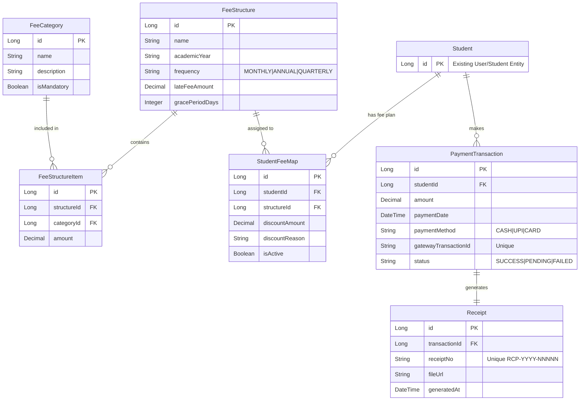

# Data Model: Finance Module

## Entity Relationship Diagram

## Database Schema (PostgreSQL)

### 1. `fee_categories`
| Column | Type | Constraints | Description |
| :--- | :--- | :--- | :--- |
| `id` | BIGSERIAL | PK | Auto-increment |
| `name` | VARCHAR(100) | UNIQUE, NOT NULL | e.g. "Tuition Fee" |
| `description` | TEXT | | |
| `is_mandatory` | BOOLEAN | DEFAULT TRUE | |

### 2. `fee_structures`
| Column | Type | Constraints | Description |
| :--- | :--- | :--- | :--- |
| `id` | BIGSERIAL | PK | |
| `name` | VARCHAR(100) | NOT NULL | e.g. "Class 10 - 2026" |
| `academic_year` | VARCHAR(20) | NOT NULL | e.g. "2026-27" |
| `frequency` | VARCHAR(20) | NOT NULL | ENUM |
| `late_fee_amount` | NUMERIC(19,2)| DEFAULT 0 | |
| `grace_period_days`| INT | DEFAULT 0 | |

### 3. `fee_structure_items`
| Column | Type | Constraints | Description |
| :--- | :--- | :--- | :--- |
| `id` | BIGSERIAL | PK | |
| `structure_id` | BIGINT | FK -> fee_structures | |
| `category_id` | BIGINT | FK -> fee_categories | |
| `amount` | NUMERIC(19,2)| NOT NULL | |

### 4. `student_fee_maps` (Ledger Config)
| Column | Type | Constraints | Description |
| :--- | :--- | :--- | :--- |
| `id` | BIGSERIAL | PK | |
| `student_id` | BIGINT | NOT NULL | Links to Core User |
| `structure_id` | BIGINT | FK -> fee_structures | |
| `discount_amount`| NUMERIC(19,2)| DEFAULT 0 | Annual discount |
| `discount_reason`| VARCHAR(255) | | |
| `is_active` | BOOLEAN | DEFAULT TRUE | |

### 5. `payment_transactions`
| Column | Type | Constraints | Description |
| :--- | :--- | :--- | :--- |
| `id` | BIGSERIAL | PK | |
| `student_id` | BIGINT | NOT NULL | |
| `amount` | NUMERIC(19,2)| NOT NULL | |
| `payment_date` | TIMESTAMP | DEFAULT NOW() | |
| `payment_method` | VARCHAR(20) | NOT NULL | ENUM |
| `gateway_txn_id` | VARCHAR(100)| UNIQUE | Idempotency Key |
| `status` | VARCHAR(20) | NOT NULL | SUCCESS/FAILED |

### 6. `receipts`
| Column | Type | Constraints | Description |
| :--- | :--- | :--- | :--- |
| `id` | BIGSERIAL | PK | |
| `transaction_id` | BIGINT | FK, UNIQUE | One-to-One |
| `receipt_no` | VARCHAR(50) | UNIQUE, NOT NULL | |
| `file_url` | VARCHAR(255) | | Path to stored PDF |

## Design Decisions

1.  **Normalization**: `FeeStructure` is separated from `FeeStructureItem` to allow reusability of Categories.
2.  **Money**: Using `NUMERIC(19,2)` for all financial columns.
3.  **Concurrency**: `payment_transactions` has a unique constraint on `gateway_txn_id` to prevent double processing at the DB level.
